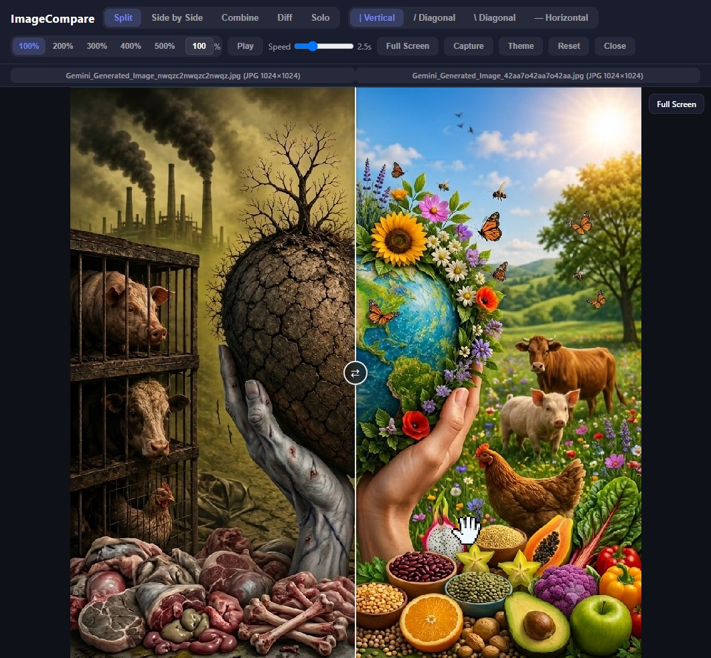

# ImageCompare-Ultimate

A single-file, fully **offline** image comparison tool. Everything (HTML + CSS +
JS) lives in one self-contained file — no server, no CDN, no network calls.
Your images never leave your machine.

Drop two images (or paste from clipboard / click to browse), then compare them in
five different view modes with cursor-anchored zoom, drag-to-pan, and a PNG
capture export.

> 

---

## Features

- **5 view modes**
  - **Split** — slider wipe between the two images, with 4 orientations:
    vertical `|`, horizontal `—`, diagonal `/` and diagonal `\`.
  - **Side by Side** — both images shown at a shared size.
  - **Combine** — A and B merged into one exportable image (side/stacked,
    with gap, background color, labels, and format/quality controls).
  - **Pixel Diff** — pixels that differ between A and B are highlighted red.
  - **Solo** — shows one image at rest; press-and-hold to reveal the other.
- **Cursor-anchored zoom** — scroll wheel zooms toward the pointer; works in
  every mode at any zoom level.
- **Drag-to-pan** — anywhere on the image pans it in every mode (the slider
  handle is the only direct slider control).
- **Diagonal divider** — the divider line is computed to be exactly collinear
  with the clip edge at any aspect ratio (`atan2` based, not a fixed 45°).
- **Autoplay sweep** — animates the slider back and forth at an adjustable speed.
- **Keyboard accessible** — focus the slider and use arrow keys (Shift = larger
  steps).
- **Fullscreen** and **PNG capture** of the current split / side-by-side view.
- **Dark / light theme** — toggle in the header, persisted to `localStorage`
  under the key `ictheme`.
- **Clipboard paste** — paste an image with Ctrl/Cmd+V onto a box or the page.

---

## Usage

1. Open `ImageCompare-Ultimate.html` in any modern browser (or host it
   statically anywhere — it's a single file).
2. On the upload screen, provide **Image A** and **Image B** via:
   - drag & drop (drop two files at once, or one per box),
   - click a box to browse, or
   - Ctrl/Cmd+V to paste from the clipboard.
3. Click **Compare**.
4. Use the header controls:
   - **View toggles**: Split · Side by Side · Combine · Diff · Solo
   - **Slider mode** (Split only): vertical / diagonal `/` / diagonal `\` / horizontal
   - **Zoom**: presets (100%–500%), a custom % input, or the mouse wheel
   - **Play**: auto-sweep the slider (adjust speed with the slider)
   - **Full Screen**, **Capture** (PNG), **Theme**, **Reset**, **Close**

> **Solo mode tip:** at rest it shows the "base" image (toggle with the
> *Base: A/B* button). Press and hold on the image to peek at the other; drag
> while holding to pan instead.

---

## Origins & Licensing

This tool is a clean-room **merge of three MIT-licensed projects**, retaining
their respective permissions:

| Project | Author | License | Repo | Features |
| ------- | ------ | ------- | ---- | -------- |
| [`beforeafter`](https://github.com/yani-/beforeafter) | [Yani Iliev](https://github.com/yani-) | MIT | `yani-/beforeafter` | Static Combine, Pixel Diff, clipboard paste |
| [`compare-image`](https://github.com/tchung1970/compare-image) | [tchung1970](https://github.com/tchung1970) | MIT | `tchung1970/compare-image` | Split / side-by-side slider, zoom/pan, PNG capture, info bar |
| [`image-swipe-compare`](https://github.com/hhkaos/image-swipe-compare) | [hhkaos](https://github.com/hhkaos) | MIT | `hhkaos/image-swipe-compare` | Diagonal slider modes, keyboard nav, fullscreen, autoplay |

The merged deliverable (`ImageCompare-Ultimate.html`) is released under the
**MIT License** — see [`LICENSE`](./LICENSE). The original `_Sources/` folder
contains the upstream files for reference.

---

## Files

```
Compare-Images/
├── ImageCompare-Ultimate.html   # the entire tool (single self-contained file)
├── LICENSE                      # MIT + upstream attribution
├── README.md                    # this file
└── _Sources/                   # upstream reference sources (MIT)
    ├── beforeafter-master/
    ├── compare-image-main/
    └── image-swipe-compare-main/
```

---

## Notes

- No build step, no dependencies, no internet required.
- The code is heavily commented with per-function docstrings and `@credit` tags
  mapping each piece back to its source project.
- Verified for correctness via JS syntax checks; please confirm interactive
  behavior in a browser.
